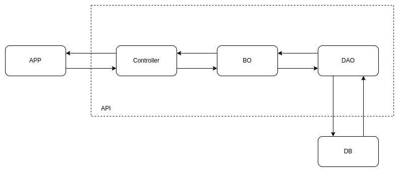
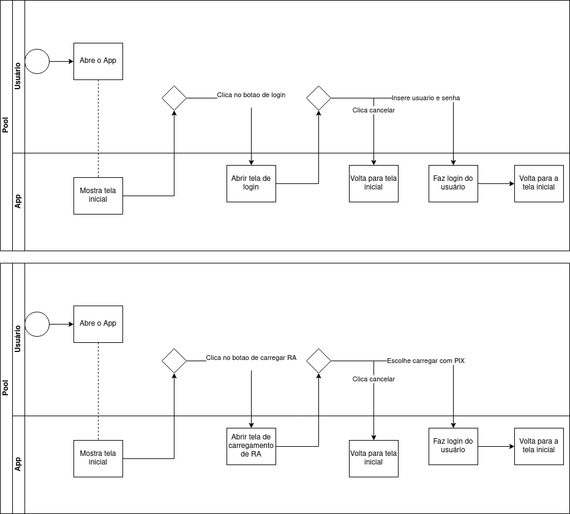

# Projeto do App

## Sketch do Projeto

MainActivity

  <Login>
    < RA >
      < Tela 1: Frente do RA com informações do aluno + foto >
      < Tela 2: Fundo do RA -> QR code p/ autentificação >
    < Saldo >
      < Tela 1: Informações do RU >
  </Login>
  < Autentificador >
    <Tela 1: Leitor de QR code >
      < Após validação: Abrir Tela 1 do RA >

User history

  
  

